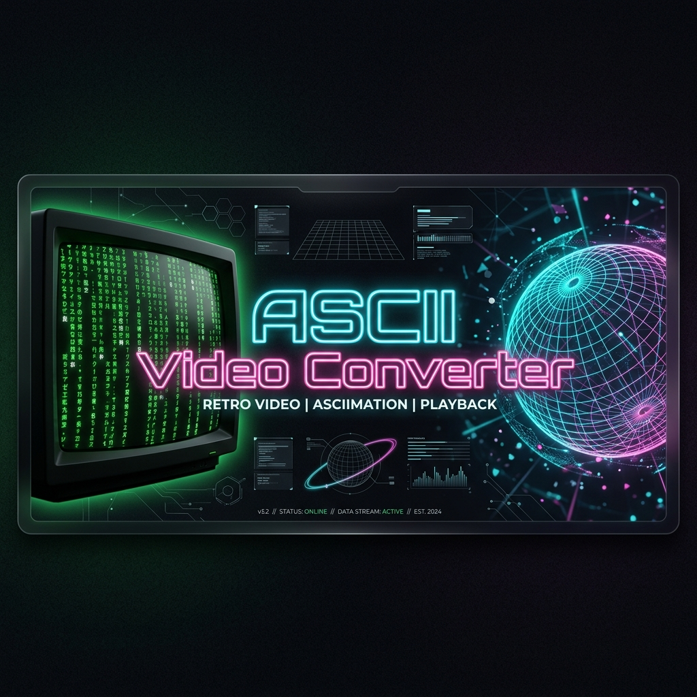

# 🎬 ASCII Player — Conversor de Video a ASCII & Generador de Prompts IA

<div align="center">
  

  <p><strong>Una suite interactiva web de última generación para renderizar videos locales y sintetizar complejas simulaciones matemáticas y físicas en arte de caracteres ASCII neón, de forma 100% local, privada y a más de 60 FPS.</strong></p>

  <p>
    <a href="https://coralgamer.github.io/ACSII-Video-Convertor---Web-Free/"></a>
    <a href="https://github.com/CoralGamer/ACSII-Video-Convertor---Web-Free/stargazers"></a>
    
  </p>

  <p>
    <a href="https://github.com/sponsors/CoralGamer">
      
    </a>
  </p>

  <details>
    <summary>Haz clic aquí para copiar el código HTML del iframe de patrocinio</summary>
    <pre><code>&lt;iframe src="https://github.com/sponsors/CoralGamer/button" title="Sponsor CoralGamer" height="32" width="114" style="border: 0; border-radius: 6px;"&gt;&lt;/iframe&gt;</code></pre>
  </details>
</div>


## ✨ Características Premium Destacadas

* **📽️ Conversor de Video Local Seguro**: Arrastra y suelta (`Drag & Drop`) cualquier video (MP4, WebM, OGG, MOV, MKV, AVI, etc.). La decodificación y transformación ocurren 100% de manera local y privada en tu navegador web.
* **👁️ Difusión de Error Floyd-Steinberg en Float32**: Elimina el banding visual típico de reproductores ASCII comunes mediante la propagación del residuo lumínico sobre píxeles adyacentes para lograr gradientes suaves y orgánicos.
* **🎨 Paletas de Colores de Alta Fidelidad**:
  * *Monocromo CRT Blanco*: Alto contraste nítido retro.
  * *CRT Fósforo Verde / Ámbar Retro*: Look analógico de las terminales VT100 y computadoras de los 80.
  * *Color Real RGB*: Mapea de manera interactiva colores de 24 bits a cada caracter individual del canvas.
  * *Cyberpunk & Vaporwave*: Degradados interactivos en tonos cian, violeta y fucsia.
  * *Lluvia Matrix Inteligente*: Contraste verde esmeralda con destellos blancos incandescentes en picos de luminancia.
* **🤖 Pipeline de IA Generativa de Texto a ASCII**:
  * **Smart Prompt Augmentation**: Enriquece tu prompt añadiendo adjetivos visuales y descriptores de renderizado profesional sin redundancias de manera automática.
  * **Motor WebGPU Text-to-Image**: Genera imágenes detalladas a `768x768` píxeles con el modelo avanzado `flux` (y fallbacks a otros modelos de difusión en caso de fallos de red/servicio).
  * **Post-Procesamiento en 3 Etapas**:
    * *Auto-Contraste*: Normaliza el histograma lumínico con recorte (clipping) al 1% para maximizar el rango dinámico del renderizado ASCII.
    * *Unsharp Mask*: Convolución de kernel Gaussiano 3x3 de paso alto restado para perfilar bordes.
    * *Edge Enhancement*: Detección de contornos por Sobel para una claridad insuperable en caracteres.
  * **Campo de Deformación Multicapa**: Ruido de desplazamiento orgánico que simula 4 capas de ondas (flujo lento de fondo, olas de frecuencia media, turbulencia de alta frecuencia y vórtice central) con zoom sinusoidal lento de respiración.
  * **Interpolación Bilineal**: Muestreo sub-pixel sobre los 4 vecinos colindantes para un warping extremadamente fluido y sin aliasing.
* **🔊 Grabador Multiformato Integrado**: Captura tu animación combinando Canvas `captureStream()` y la API `MediaRecorder` para descargar archivos MP4, WebM, MKV, MOV o AVI con audio original perfectamente sincronizado.
* **⭐ Sincronización en Tiempo Real de GitHub Stars**: Cuenta oficial interactiva con refresco inteligente al reenfocar la pestaña y destellos dinámicos de agradecimiento en la interfaz.

---

## 🛠️ Arquitectura Técnica y Ecuaciones

### 1. Luminancia Relativa (Fórmula NTSC BT.709)
Normalizamos la intensidad visual de cada canal según la percepción lumínica humana:
$$Y = 0.2126 \cdot R + 0.7152 \cdot G + 0.0722 \cdot B$$

### 2. Dithering por Difusión de Error Floyd-Steinberg
El error entre el valor original del píxel y el caracter ASCII asignado se redistribuye localmente para suavizar sombras y contornos:
$$\text{Error} = Y_{\text{píxel}} - \text{Densidad}_{\text{caracter}}$$
$$\text{Vecindad:} \quad (X+1, Y) \to \frac{7}{16}, \quad (X-1, Y+1) \to \frac{3}{16}, \quad (X, Y+1) \to \frac{5}{16}, \quad (X+1, Y+1) \to \frac{1}{16}$$

### 3. Interpolación Bilineal Subpixel
Durante la distorsión del render de fluidos IA, los píxeles intermedios se calculan mediante un promedio ponderado de los 4 vecinos contiguos:
$$f(x, y) \approx (1 - \Delta x)(1 - \Delta y) \cdot Q_{11} + \Delta x(1 - \Delta y) \cdot Q_{21} + (1 - \Delta x)\Delta y \cdot Q_{12} + \Delta x \Delta y \cdot Q_{22}$$

---

## 🚀 Guía de Lanzamiento y Desarrollo Local

### Método 1: Apertura Directa
Abre el archivo `index.html` en tu navegador moderno preferido.

### Método 2: Servidor Web Local (Recomendado para evitar bloqueos por CORS de recursos en disco)
* **Con Python 3**:
  ```bash
  python -m http.server 8000
  ```
* **Con Node.js**:
  ```bash
  npx http-server ./ -p 8000
  ```
Accede a `http://localhost:8000` en tu navegador.

---

## ⚖️ Licencia y Créditos

* **Desarrollador Principal**: Nicolas Romero ([@coralgamer](https://github.com/nicolas-romero))
* **Licencia**: Distribuido bajo la **Licencia MIT**. Consulta [LICENSE](LICENSE) para más detalles.
